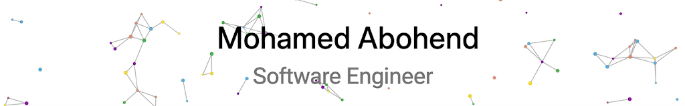

<h1 align="center">Hi 👋, I'm Mohamed Abohend</h1>
<h3 align="center">Web Developer</h3>

  

---

### 👨‍💻 About Me
- 💻 Full-Stack Developer specializing in **ASP.NET Core** and **React.js**
- 🎓 Computer Engineering Graduate  
- 🚀 Passionate about building scalable and secure web applications  
- 📚 Currently improving problem-solving and system design skills  

---

### 🤝 Connect with Me

### 🛠️ Languages

 

---

### ⚙️ Tools & Technologies

 

---

### 📊 GitHub Stats

  

  

